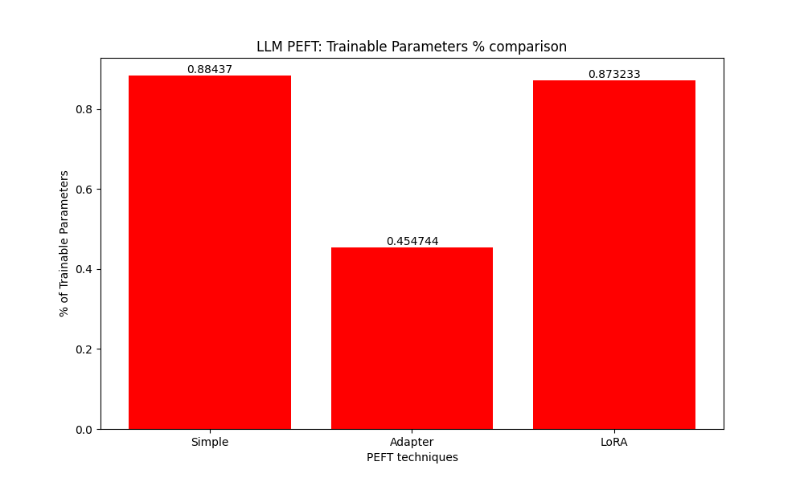
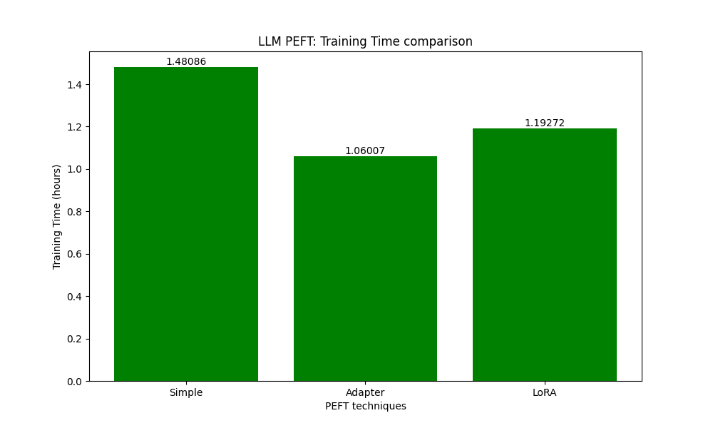
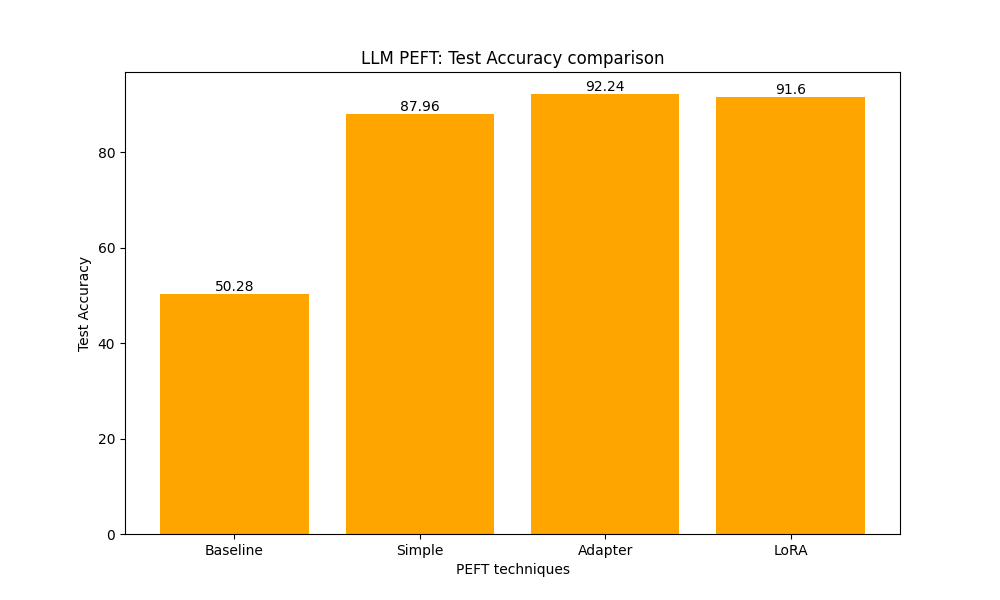
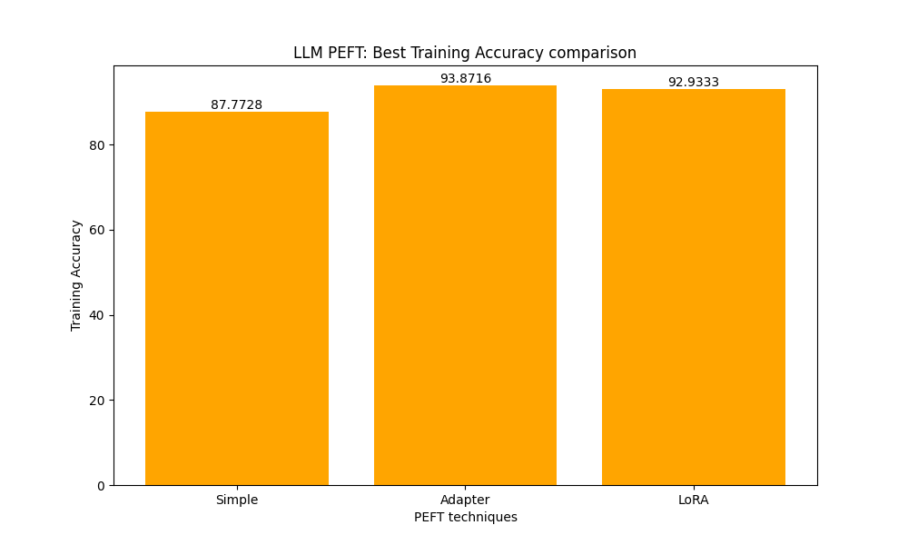

# Parameter Efficient Fine-Tuning (PEFT) Techniques for LLMs: A Comparative Study 

This project provides a detailed, from-scratch exploration and implementation of three popular PEFT techniques for fine-tuning large language models:

* **Simple Fine-Tuning:** Unfreeze and fine-tune the last two layers (classification head)
* **Adapter Layers:** Introduce small adapter modules in the transformer block.
* **LoRA (Low-Rank Adaptation):** Efficiently fine-tune by injecting low-rank matrices across the network.

The primary focus is on deep understanding of the mechanics behind these techniques, rather than achieving state-of-the-art performance. The dataset used for the experiments is a binary text classification task, which you can replace with your own dataset.

## Blog Post
The project is accompanied by a detailed blog post that provides a comprehensive overview of PEFT techniques, their implementation, and a comparative study of the three methods: 
[Fine-tuning LLMs efficiently: A practical deep dive]()

## Key Goals

* **Understanding PEFT:** Build a strong foundation in the theoretical underpinnings and practical implementation of PEFT methods.
* **Direct Comparison:**  Conduct rigorous experiments to compare the three PEFT techniques across various metrics.
* **Hands-On Implementation:** Implement the techniques from scratch using PyTorch.
* **Reproducibility:** Ensure that the experiments are reproducible and well-documented.
* **Insights and Findings:** Draw key insights from the experiments and summarize the findings.
* **Educational Resource:** Serve as a comprehensive educational resource for PEFT techniques.

## Project Structure

* **`data_utils/`:**  Contains the the utility functions to load and preprocess the dataset.
    - Loads the data, tokenizes the text, and sets up the dataloaders.
* **`modeling/`:**  Houses the OOP implementation of the 3 PEFT techniques.
    - Simple Fine-Tuning
    - Adapter Layers
    - LoRA
* **`evaluation/`:**  Contains helpful utilies to save the experiment results and visualize them using plots.
* **`finetuning.py`:**  The main script to run the experiments.

## Experiments

The experiments compare the PEFT techniques on the following metrics:

* **Training Accuracy and Loss**
* **Test Accuracy and Loss**
* **Percentage of Trainable Parameters**
* **Training Time**

### Details
* Fine-tuning downstream task: Binary Text Classification
* Dataset: [`stanfordnlp/imdb`](https://huggingface.co/datasets/stanfordnlp/imdb)
* Model: [`distilbert/distilbert-base-uncased`](https://huggingface.co/distilbert/distilbert-base-uncased)
* PEFT Techniques: Simple Fine-Tuning, Adapter Layers, LoRA

## Results and Findings

- **Simple Fine-Tuning:** 
    - Achieved a test accuracy of 87.96%.
    - Highest percentage of trainable parameters.
    - Slowest convergence.

- **Adapter Layers:**
    - Achieved a test accuracy of 92.24%.
    - Lowest percentage of trainable parameters.
    - Fastest convergence compared to simple fine-tuning and LoRA.

- **LoRA:**
    - Achieved a test accuracy of 91.6%.
    - Moderate percentage of trainable parameters, just lower than simple fine-tuning.
    - Faster convergence compared to simple fine-tuning.

- **Plots:**
    <table>
    <tr>
        <td></td>
        <td></td>
    </tr>
    <tr>
        <td></td>
        <td></td>
    </tr>
    </table>

    

## References
- Paper: [Parameter-Efficient Transfer Learning for NLP](https://arxiv.org/pdf/1902.00751)
- Paper: [Low-Rank Adaptation in Large Language Models](https://arxiv.org/pdf/2106.09685)
- https://lightning.ai/pages/community/article/understanding-llama-adapters/
- https://lightning.ai/pages/community/article/lora-llm/
- https://lightning.ai/lightning-ai/studios/code-lora-from-scratch?tab=overview